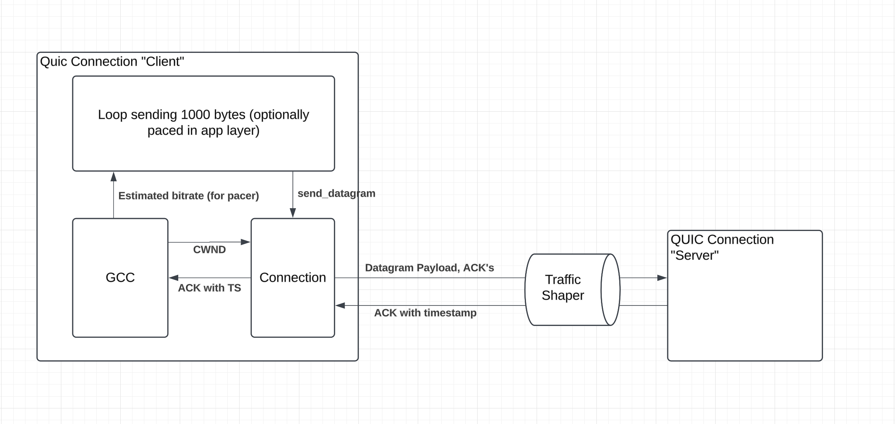
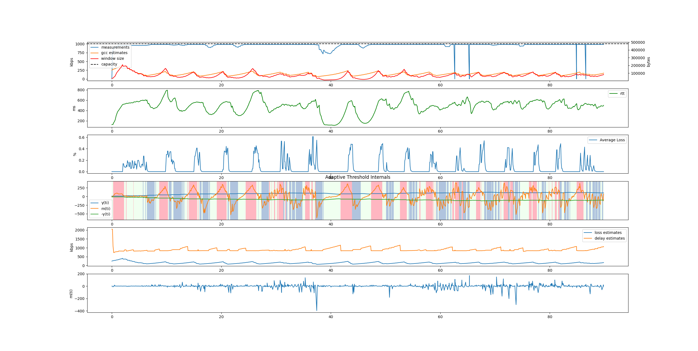
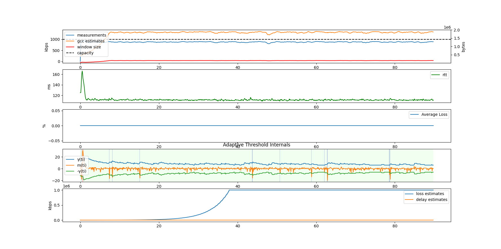
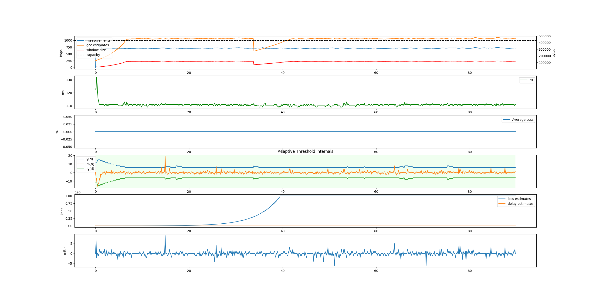
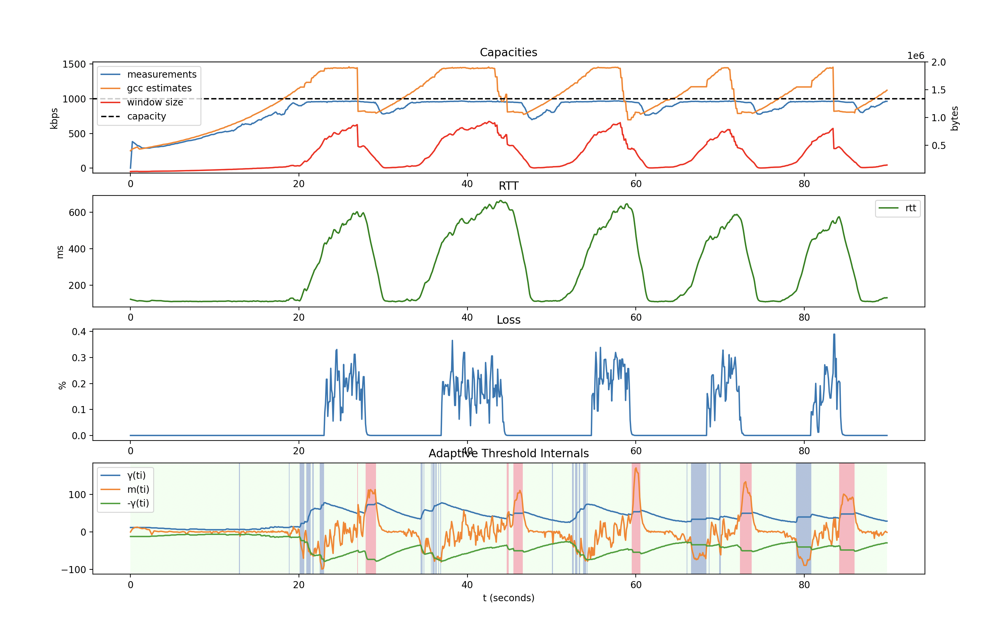

# GCC Experiments and Results

Various scenarios were run and tested against Quinn using the QUIC adapted version of the GCC congestion controller. Plots were included to help visualize the behavior of the system.

## Test Setup



A QUIC connection is created between two endpoints, a client and a server. Both QUIC connections support ACK with timestamps and have a GCC congestion controller. The test application in a loop, calls `send_datagram` with a 1000 byte payload in a loop, paced at a certain interval. The interval could be static (ie every 7ms), or it could be dynamically calculated based on the GCC estimated bitrate feedback. The choice between either is selected by the test case.

A traffic shaper is used to control certain aspects of the network, such as link capacity, packet loss rate, and propogation delay. The traffic shaper's used were the `dnctl` and `pfctl` utilities found on MacOS.

## Test Variabes

- Link capacity: the maximum bitrate on the link
- Packet Loss Rate: the fraction of packets dropped
- Propogation delay: the delay added to simulate network delays
- Dynamic Interval Calculation (uses the estimated GCC bitrate to set the interval)
- Static send interval (if dynamic is not used)

## How to run

The test case is located at `./quinn/examples/gcc_test.rs`.

To run the test and log only the output of the GCC trace logs, use the following command.
```RUST_LOG=quinn_proto::congestion::gcc=TRACE cargo run --example gcc_test```

A shell script is available at `./traffic_shape.sh` which will apply a 1000 Kbit/s capacity on the network link between the two QUIC connections for the test above. There are other parameters that can be changed, see `man dnctl` for more details. (This scripts requires `sudo`).

The trace logs from the GCC component is logged as JSON to a file at `gcc_output.log` which is then used by `plot.py` to generate graphs to visualize the GCC behavior.

The command is `python3 plot.py` and requires a matplotlib dependency.

## Test cases:

### Static Interval Above Link Capacity

Interval: 7ms -> 1142 kbps
1000 kbps capacity
0% packet loss
50 ms delay


Outflow is limited by Quinn's congestion control window. Notice the window size compared to others.

### Static Interval At Capacity

Interval: 8ms -> 1000 kpbs
1000 kbps capacity
0% packet loss
50 ms delay


### Static Interval Below Link Capacity

Interval: 10ms -> 800 kbps
1000 kbps capacity
0% packet loss
50 ms delay


### Dynamic Interval

1000 kbps capacity
0% packet loss
50 ms delay



## References

- [GCC Analysis](https://c3lab.poliba.it/images/6/65/Gcc-analysis.pdf)
- [ACK timestamp draft](https://www.ietf.org/archive/id/draft-smith-quic-receive-ts-00.html)
- [GCC](https://datatracker.ietf.org/doc/html/draft-ietf-rmcat-gcc-02)
- [QUIC Datagram RFC](https://datatracker.ietf.org/doc/html/rfc9221)
- [QUIC recovery](https://datatracker.ietf.org/doc/html/draft-ietf-quic-recovery-34)
- [QUIC rfc](https://datatracker.ietf.org/doc/html/rfc9000)
